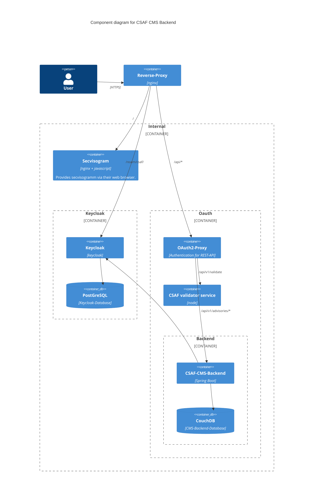

# BSI Secvisogram CSAF Backend


- [About The Project](#about-the-project)
- [Getting started](#getting-started)
- [How to use](#how-to-use)
- [Developing](#developing)
- [Contributing](#contributing)
- [Dependencies](#dependencies)

## About The Project

This is the backend for a Content Management System for CSAF documents.
It offers a REST service for listing, searching, deleting, creating, commenting on and exporting CSAF documents.

[(back to top)](#bsi-secvisogram-csaf-backend)

## Getting started

To run the CSAF CMS server you need the following:

- [Keycloak](https://www.keycloak.org/)
- A proxy like [oauth2-proxy](https://oauth2-proxy.github.io/oauth2-proxy/)
- [CouchDB](https://couchdb.apache.org/)

You can find an example setup for local development in the 'compose.yaml' and
an example configuration for Keycloak in 'keycloak/csaf-realm.json'. You can
take this as a starting point, but please check the documentation of the
individual projects for a proper production setup. We also recommend
running everything behind some kind of reverse proxy. Please take a look at our
[Architecture](https://github.com/secvisogram/csaf-cms-backend/blob/main/documents/BSISecvisogramArchitecture.drawio.svg)
for an overview.

The [secvisogram](https://github.com/secvisogram/secvisogram) frontend is usable
as a standalone version without this server. You can still use this standalone
mode if the frontend is not behind the proxy, like in the development setup.
In this setup where both standalone and server mode are available, the login is
only required to manage documents on the server or validate against the
[validator service](https://github.com/secvisogram/csaf-validator-service).

To build the application run:

```shell
./mvnw package
```

The resulting jar file in the `target` folder can then be run with
`java -jar filename.jar`. To manage the process you can use Docker or an init
system of your choice.

[(back to top)](#bsi-secvisogram-csaf-backend)

## How to use

Please have a look at the [API documentation](https://secvisogram.github.io/csaf-cms-backend/) on how to use this application.

[(back to top)](#bsi-secvisogram-csaf-backend)

### Management of tracking information

The system automatically manages information under `document/tracking` of CSAF documents.
The revision history is managed as described in the [architecture decisions document](documents/architecture-decisions.md).

The tracking ID is automatically set to a temporary ID when creating a new advisory and updated to a final ID when the document is published.
For generating the tracking IDs, a company name should be set in the environment variable `CSAF_TRACKINGID_COMPANY`.
The variable `CSAF_TRACKINGID_DIGITS` defines the number of digits used in the tracking ID. It defaults to 5 if nothing is set.
If `CSAF_REFERENCES_BASE_URL` is defined, a reference in `document/references` with the set URL is added when publishing the document.
See **.env.example** for an example configuration.

### Management of engine data

When creating or updating an advisory, the information for `document/tracking/engine` is updated.
The `name` and `version` are set according to the corresponding values of the backend's build. 

### Importing

Existing valid and published advisories can be imported on startup of the application.
The advisories to be imported must be stored in JSON format in a directory called `import` in the root directory.
Duplicates are identified by their tracking ID and not imported again.

## Developing

The configuration of the application as well as the compose file is done in
a local **.env** file. To start, simply copy the **.env.example** file to **.env**.
If you want different passwords, database names or ports you can change them
in that file. Please note that the following setup is for development purposes
only and should not be used in production.



- run `docker compose up`
- To set up our CouchDB server open `http://127.0.0.1:5984/_utils/#/setup`
  and run the [Single Node Setup](https://docs.couchdb.org/en/stable/setup/single-node.html). This creates databases like **_users** and stops CouchDB from spamming our logs (Admin credentials from .env)
- Create a database in CouchDB with the name specified in `CSAF_COUCHDB_DBNAME`
- Open `http://localhost:9000/` and log in with the admin user.
    - The port is defined in .env - CSAF_KEYCLOAK_PORT, default 9000
    - Select `CSAF`-Realm
    - On the left side, navigate to "Clients" and select the Secvisogram client.
    - Select the **Credentials** tab and copy the Secret. This is our
      `CSAF_CLIENT_SECRET` environment variable.
- [Generate a cookie secret](https://oauth2-proxy.github.io/oauth2-proxy/configuration/overview#generating-a-cookie-secret)
  and paste it in `CSAF_COOKIE_SECRET`.
- restart compose
- (required for exports) install [pandoc (tested with version 2.18)](https://pandoc.org/installing.html)
  as well as [weasyprint (tested with version 56.0)](https://weasyprint.org/) and make sure both are in
  your PATH
- (optional for exports) define the path to a company logo that should be used in the exports through the environment variable `CSAF_COMPANY_LOGO_PATH`. The path can either be relative to the project root or absolute. See .env.example file for an example.

You should now be able to start the spring boot application, navigate to
`http://localhost/api/v1/about`, log in with one of the users and get a
response from the server.

You should now be able to access Secvisogram, navigate to `http://localhost/`.
There are the following default users:

|User       |Password   |Roles                                                        |
|-----      |--------   |-----                                                        |
|registered |registered |**registered**                                               |
|author     |author     |registered, editor, **author**                               |
|editor     |editor     |registered, **editor**                                       |
|publisher  |publisher  |registered, editor, **publisher**                            |
|reviewer   |reviewer   |registered, **reviewer**                                     |
|auditor    |auditor    |**auditor**                                                  |
|all        |all        |**auditor, reviewer, publisher, editor, author, registred**  |
|none       |none       |                                                             |

### Login & Logout in combination with Secvisogram

Some explantion on the logoutUrl configured in `.well-known/appspecific/de.bsi.secvisogram.json` for Secvisogram

``` 
"logoutUrl": "/oauth2/sign_out?rd=http://localhost/realms/csaf/protocol/openid-connect/logout?post_logout_redirect_uri=http%3A%2F%2Flocalhost&client_id=secvisogram", 
```

`/oauth2/sign_out` is the logout URI from the OAUTH-Proxy. This will invalidate the session on the proxy. Then, a redirect to Keycloak (`http://localhost/realms/csaf/protocol/openid-connect/logout?post_logout_redirect_uri=http%3A%2F%2Flocalhost&client_id=secvisogram`) is necessary to log out from the session on Keyloak. Subsequently, there is a redirect back to Secvisogram (`localhost`).
When hostnames are changed, this has to adapted.

### build and execute tests

`` ./mvnw clean verify``


### start application

`` ./mvnw spring-boot:run``

with main class: de.bsi.secvisogram.csaf_cms_backend.SecvisogramApplication

### check application running

The port is defined in .env - CSAF_CMS_BACKEND_PORT, default 8081.

http://localhost:8081/api/v1/about

Swagger UI

http://localhost:8081/swagger-ui/index.html

OpenAPI specification

http://localhost:8081/api-docs

### access couchDB

The port is defined in .env - CSAF_CMS_BACKEND_PORT, default 5984.

[http://localhost:5984/_utils/#login](http://localhost:5984/_utils/#login)

CouchDb Info (port is defined in .env):

[http://localhost:5984/](http://localhost:5984/)

## Contributing

You can find our guidelines here [CONTRIBUTING.md](https://github.com/secvisogram/secvisogram/blob/main/CONTRIBUTING.md)

[(back to top)](#bsi-secvisogram-csaf-backend)

## Dependencies

### Check for Maven Plugin update

`` ./mvnw versions:display-plugin-updates `` 

## Check for dependency update
`` ./mvnw versions:display-dependency-updates ``

### Spring Boot

#### Reference Documentation

For further reference, please consider the following sections:

* [Official Gradle documentation](https://docs.gradle.org)
* [Spring Boot Gradle Plugin Reference Guide](https://docs.spring.io/spring-boot/docs/2.6.2/gradle-plugin/reference/html/)
* [Create an OCI image](https://docs.spring.io/spring-boot/docs/2.6.2/gradle-plugin/reference/html/#build-image)
* [Mustache](https://docs.spring.io/spring-boot/docs/2.6.2/reference/htmlsingle/#boot-features-spring-mvc-template-engines)
* [Spring Data Couchbase](https://docs.spring.io/spring-boot/docs/2.6.2/reference/htmlsingle/#boot-features-couchbase)
* [Spring Web](https://docs.spring.io/spring-boot/docs/2.6.2/reference/htmlsingle/#boot-features-developing-web-applications)

[(back to top)](#bsi-secvisogram-csaf-backend)

#### Guides

The following guides illustrate how to use some features concretely:

* [Building a RESTful Web Service](https://spring.io/guides/gs/rest-service/)
* [Serving Web Content with Spring MVC](https://spring.io/guides/gs/serving-web-content/)
* [Building REST services with Spring](https://spring.io/guides/tutorials/bookmarks/)

[(back to top)](#bsi-secvisogram-csaf-backend)

#### Additional Links

These additional references should also help you:

* [Gradle Build Scans – insights for your project's build](https://scans.gradle.com#gradle)

[(back to top)](#bsi-secvisogram-csaf-backend)

### Code Quality Rules

[Exxcellent Code Quality Rules](https://www.exxcellent.de/confluence/pages/viewpage.action?pageId=65113099)

[(back to top)](#bsi-secvisogram-csaf-backend)

#### SpotBugs

- [IntelliJ SpotBugs](https://plugins.jetbrains.com/plugin/14014-spotbugs)
- [spotbugs-gradle-plugin](https://github.com/spotbugs/spotbugs-gradle-plugin)
- [find-sec-bugs](https://find-sec-bugs.github.io/)

[(back to top)](#bsi-secvisogram-csaf-backend)

#### Jacoco

- [Jacoco Plugin](https://docs.gradle.org/current/userguide/jacoco_plugin.html#sec:jacoco_report_configuration)

[(back to top)](#bsi-secvisogram-csaf-backend)

### Links

#### CSAF

[OASIS CSAF](https://oasis-open.github.io/csaf-documentation/)

[BSI CSAF](https://www.bsi.bund.de/DE/Themen/Unternehmen-und-Organisationen/Informationen-und-Empfehlungen/Empfehlungen-nach-Angriffszielen/Industrielle-Steuerungs-und-Automatisierungssysteme/CSAF/CSAF_node.html)

[(back to top)](#bsi-secvisogram-csaf-backend)

#### JSON

- [CSAF 2.0 JSON Schema](https://docs.oasis-open.org/csaf/csaf/v2.0/csaf_json_schema.json)
- [JSON Schema](https://json-schema.org/draft/2019-09/json-schema-core.html)
- [JSON Schema Validation](https://json-schema.org/draft/2019-09/json-schema-validation.html)
- [JSON Hyper-Schema](https://json-schema.org/draft/2019-09/json-schema-hypermedia.html)
- [CVSS 2.0](https://www.first.org/cvss/cvss-v2.0.json)
- [CVSS 3.0](https://www.first.org/cvss/cvss-v3.0.json)
- [CVSS 3.1](https://www.first.org/cvss/cvss-v3.1.json)
- [JSON API](https://jsonapi.org/)
- [JSON Patch](http://jsonpatch.com/)
- [JSON Pointer](https://datatracker.ietf.org/doc/html/rfc6901)

[(back to top)](#bsi-secvisogram-csaf-backend)

#### Mustache

[Mustache samskivert](https://github.com/samskivert/jmustache)

[(back to top)](#bsi-secvisogram-csaf-backend)

#### PoC for Backend

[PoC Backend](https://github.com/csaf-poc/csaf_backend)

[(back to top)](#bsi-secvisogram-csaf-backend)

#### Open API/ Swagger

[Open API](https://www.openapis.org/)
[Swagger Annotations](https://github.com/swagger-api/swagger-core/wiki/Swagger-2.X---Annotations)

[(back to top)](#bsi-secvisogram-csaf-backend)

#### diagrams.net (formerly known as draw.io)

- [diagrams.net](https://www.diagrams.net/)

- [Intellij Integration](https://plugins.jetbrains.com/plugin/15635-diagrams-net-integration)

[(back to top)](#bsi-secvisogram-csaf-backend)
