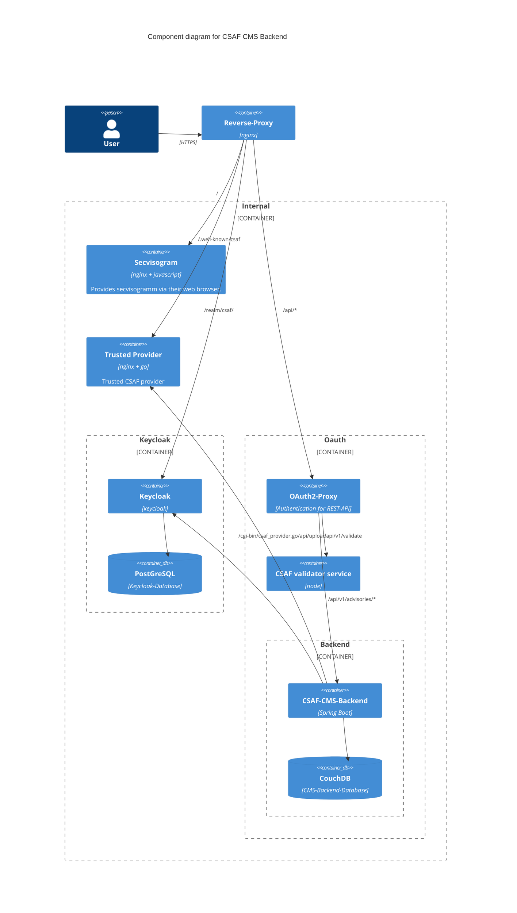

# BSI Secvisogram CSAF Backend


- [About The Project](#about-the-project)
- [Getting started](#getting-started)
- [How to use](#how-to-use)
- [Developing](#developing)
- [Contributing](#contributing)
- [Dependencies](#dependencies)

## About The Project

This is the backend for a Content Management System for CSAF documents.
It offers a REST service for listing, searching, deleting, creating, commenting on and exporting CSAF documents.

[(back to top)](#bsi-secvisogram-csaf-backend)

## Getting started

To run the CSAF CMS server you need the following:

- [Keycloak](https://www.keycloak.org/)
- A proxy like [oauth2-proxy](https://oauth2-proxy.github.io/oauth2-proxy/)
- [CouchDB](https://couchdb.apache.org/)

You can find an example setup for local development in the 'compose.yaml' and
an example configuration for Keycloak in 'docker/config/keycloak/csaf-realm.json'. You can
take this as a starting point, but please check the documentation of the
individual projects for a proper production setup. We also recommend
running everything behind some kind of reverse proxy. Please take a look at our
[Architecture](https://github.com/secvisogram/csaf-cms-backend/blob/main/documents/BSISecvisogramArchitecture.drawio.svg)
for an overview.

The [secvisogram](https://github.com/secvisogram/secvisogram) frontend is usable
as a standalone version without this server. You can still use this standalone
mode if the frontend is not behind the proxy, like in the development setup.
In this setup where both standalone and server mode are available, the login is
only required to manage documents on the server or validate against the
[validator service](https://github.com/secvisogram/csaf-validator-service).

To build the application run:

```shell
./mvnw package
```

The resulting jar file in the `target` folder can then be run with
`java -jar filename.jar`. To manage the process you can use Docker or an init
system of your choice.

Alternatively, a ready-to-run container image is published to
[`ghcr.io/secvisogram/csaf-cms-backend`](https://github.com/secvisogram/csaf-cms-backend/pkgs/container/csaf-cms-backend)
(built from `alpine.Dockerfile` by [`.github/workflows/docker-publish.yml`](.github/workflows/docker-publish.yml)
on every release), configured entirely through environment variables (see `.env.example`).

[(back to top)](#bsi-secvisogram-csaf-backend)

## How to use

Please have a look at the [API documentation](https://secvisogram.github.io/csaf-cms-backend/) on how to use this application.

[(back to top)](#bsi-secvisogram-csaf-backend)

### Management of tracking information

The system automatically manages information under `document/tracking` of CSAF documents.
The revision history is managed as described in the [architecture decisions document](documents/architecture-decisions.md).

The tracking ID is automatically set to a temporary ID when creating a new advisory and updated to a final ID when the document is published.
For generating the tracking IDs, a company name should be set in the environment variable `CSAF_TRACKINGID_COMPANY`.
The variable `CSAF_TRACKINGID_DIGITS` defines the number of digits used in the tracking ID. It defaults to 5 if nothing is set.
If `CSAF_REFERENCES_BASE_URL` is defined, a reference in `document/references` with the set URL is added when publishing the document.
See **.env.example** for an example configuration.

### Management of engine data

When creating or updating an advisory, the information for `document/tracking/engine` is updated.
The `name` and `version` are set according to the corresponding values of the backend's build.

### Importing

Existing valid and published advisories can be imported on startup of the application.
The advisories to be imported must be stored in JSON format in a directory called `import` in the root directory.
Duplicates are identified by their tracking ID and not imported again.

## Developing

Configuration is split across two **.env** files, each with its own **.env.example** template:

- **`.env`** (repo root): configuration for the backend application itself (CouchDB connection,
  OIDC issuer, document templates, versioning, tracking IDs, workflow flags, ...). This is read
  both when running the backend on the host (`./mvnw spring-boot:run`) and by the containerized
  `csaf-cms-backend` compose service.
- **`docker/.env`**: configuration needed only to orchestrate the local docker compose stack
  itself (Keycloak, oauth2-proxy, CouchDB container credentials, ports, ...).

To start, copy **both** `.env.example` files to `.env` (`cp .env.example .env` in the repo root,
and `cp docker/.env.example docker/.env`). A few values (e.g. CouchDB credentials, the backend
port) intentionally appear in both files, with comments cross-referencing each other — keep them
in sync if you change them. Please note that the following setup is for development purposes
only and should not be used in production.


```mermaid
   C4Component
    title Component diagram for CSAF CMS Backend

    Person(user,"User")
    Container(reverseproxy, "Reverse-Proxy", "nginx")
    
    Container_Boundary(c4, "Internal") {
        Container(secvisogram, "Secvisogram", "nginx + javascript", "Provides secvisogramm via their web browser.")

        Container_Boundary(c2, "Keycloak") {
            Container(keycloak, "Keycloak", "keycloak")
            ContainerDb(keycloak-db, "PostGreSQL", "Keycloak-Database")
        }

        Container_Boundary(c3, "Oauth") {
            Container(oauth, "OAuth2-Proxy", "Authentication for REST-API")
            Container(validator, "CSAF validator service", "node")

            Container_Boundary(c1, "Backend") {
                Container(backend, "CSAF-CMS-Backend", "Spring Boot")
                ContainerDb(backend-db, "CouchDB", "CMS-Backend-Database")
            }
        }
        
        Container(trustedprovider, "Trusted Provider", "nginx + go", "Trusted CSAF provider")
    }

    Rel(user, reverseproxy,"","HTTPS")
    Rel(reverseproxy, secvisogram,"/")
    Rel(reverseproxy, trustedprovider,"/.well-known/csaf")
    Rel(reverseproxy, oauth,"/api/*")
    Rel(reverseproxy, keycloak,"/realm/csaf/")
    Rel(oauth, validator, "/api/v1/test")
    Rel(oauth, validator, "/api/v1/validate")
    Rel(oauth, backend, "/api/v1/advisories/*")
    Rel(backend, backend-db,"")
    Rel(backend, keycloak,"")
    Rel(keycloak, keycloak-db,"")
    Rel(backend, trustedprovider,"/cgi-bin/csaf_provider.go/api/upload")
   

```

- run `docker compose up -d --build` in folder `docker`
- To set up our CouchDB server open `http://127.0.0.1:5984/_utils/#/setup`
  and run the [Single Node Setup](https://docs.couchdb.org/en/stable/setup/single-node.html). This creates databases like **_users** and stops CouchDB from spamming our logs (Admin credentials from docker/.env)
- Create a database in CouchDB with the name specified in `CSAF_COUCHDB_DBNAME`
- Keycloak is initialized automatically: on startup it imports the `csaf-realm`,
  the `secvisogram` client, all client roles and the development test users from
  `docker/config/keycloak/csaf-realm.json` (via `--import-realm`). There is no manual
  setup step and no need to copy the client secret out of the Keycloak UI.
    - `CSAF_CLIENT_SECRET` in `docker/.env` is a **fixed, development-only value**
      (see `docker/.env.example`). Keycloak imports the realm with this secret and
      oauth2-proxy is configured with the same value, so both sides always match.
      If you change it after the first start, delete the Keycloak database volume
      (`docker/data/keycloak-db`) so the realm gets re-imported with the new secret.
    - Note: `--import-realm` only imports the realm if it does not already exist. If you
      change the realm file later and want it re-imported, remove the Keycloak database
      volume first: `docker compose down` and delete `docker/data/keycloak-db`.
- [Generate a cookie secret](https://oauth2-proxy.github.io/oauth2-proxy/configuration/overview#generating-a-cookie-secret)
  and paste it into `CSAF_COOKIE_SECRET` in `docker/.env` (also before the first `up -d`).
- The trusted CSAF provider can be initialized with `docker compose up trusted-provider-setup`
  - The folder `docker/config/trustedprovider` contains example / development PGP keys.
  - More details on configuring the trusted provider can be found [GoCSAF](https://github.com/gocsaf/csaf)
- (required for exports) install [pandoc (tested with version 2.18)](https://pandoc.org/installing.html)
  as well as [weasyprint (tested with version 56.0)](https://weasyprint.org/) and make sure both are in
  your PATH
- (optional for exports) define the path to a company logo that should be used in the exports through the environment variable `CSAF_COMPANY_LOGO_PATH`. The path can either be relative to the project root or absolute. See .env.example file for an example.
- CSAF-CMS-Backend itself is started as part of `docker compose up -d` (service `csaf-cms-backend`).
  This uses the image published to `ghcr.io/secvisogram/csaf-cms-backend` (built and pushed by
  [`.github/workflows/docker-publish.yml`](.github/workflows/docker-publish.yml) from
  `alpine.Dockerfile`) if already present/pulled; run `docker compose build csaf-cms-backend` to
  build it locally from source instead (e.g. while working on backend changes). No separate
  `./mvnw spring-boot:run` step is needed for normal development.

You should now be able to navigate to `http://localhost/api/v1/about`, log in with one of the
users and get a response from the server.

#### Debugging the backend

To run/debug the backend on the host (e.g. from an IDE) instead of in its container:

1. Stop the container: `docker compose stop csaf-cms-backend`
2. In `docker/.env`, set `CSAF_CMS_BACKEND_HOST=host.docker.internal`
3. Restart oauth2-proxy so it picks up the change: `docker compose up -d oauth2-proxy`
4. Start the backend on the host: `./mvnw spring-boot:run`

To switch back to the containerized backend, set `CSAF_CMS_BACKEND_HOST` back to
`csaf-cms-backend.csaf.internal` and run `docker compose up -d` again.

You should now be able to access Secvisogram, navigate to `http://localhost/`.
There are the following default users:

|User       |Password   |Roles                                                        |
|-----      |--------   |-----                                                        |
|registered |registered |**registered**                                               |
|author     |author     |registered, editor, **author**                               |
|editor     |editor     |registered, **editor**                                       |
|publisher  |publisher  |registered, editor, **publisher**                            |
|reviewer   |reviewer   |registered, **reviewer**                                     |
|auditor    |auditor    |**auditor**                                                  |
|all        |all        |**auditor, reviewer, publisher, editor, author, registred**  |
|none       |none       |                                                             |

### Login & Logout in combination with Secvisogram

Some explanation on the logoutUrl configured in `.well-known/appspecific/de.bsi.secvisogram.json` for Secvisogram

``` 
"logoutUrl": "/oauth2/sign_out?rd=http://localhost/realms/csaf/protocol/openid-connect/logout?post_logout_redirect_uri=http%3A%2F%2Flocalhost&client_id=secvisogram", 
```

`/oauth2/sign_out` is the logout URI from the OAUTH-Proxy. This will invalidate the session on the proxy. Then, a redirect to Keycloak (`http://localhost/realms/csaf/protocol/openid-connect/logout?post_logout_redirect_uri=http%3A%2F%2Flocalhost&client_id=secvisogram`) is necessary to log out from the session on Keycloak. Subsequently, there is a redirect back to Secvisogram (`localhost`).
When hostnames are changed, this has to adapted.

### build and execute tests

`` ./mvnw clean verify``


### start application

By default, the backend is started as the `csaf-cms-backend` service in `docker compose up -d`
(see `docker/compose.yaml`, built from `alpine.Dockerfile`).

To run/debug it on the host instead, see [Debugging the backend](#debugging-the-backend);
in short:

`` ./mvnw spring-boot:run``

with main class: de.bsi.secvisogram.csaf_cms_backend.SecvisogramApplication

### check application running

The port is defined in .env - CSAF_CMS_BACKEND_PORT, default 8081.

http://localhost:8081/api/v1/about

Swagger UI

http://localhost:8081/swagger-ui/index.html

OpenAPI specification

http://localhost:8081/api-docs

### access couchDB

The port is defined in docker/.env - CSAF_COUCHDB_PORT, default 5984.

[http://localhost:5984/_utils/#login](http://localhost:5984/_utils/#login)

CouchDb Info (port is defined in docker/.env):

[http://localhost:5984/](http://localhost:5984/)

## Contributing

You can find our guidelines here [CONTRIBUTING.md](https://github.com/secvisogram/secvisogram/blob/main/CONTRIBUTING.md)

[(back to top)](#bsi-secvisogram-csaf-backend)

## Dependencies

### Check for Maven Plugin update

`` ./mvnw versions:display-plugin-updates ``

## Check for dependency update
`` ./mvnw versions:display-dependency-updates ``

### Spring Boot

#### Reference Documentation

For further reference, please consider the following sections:

* [Mustache](https://docs.spring.io/spring-boot/docs/2.6.2/reference/htmlsingle/#boot-features-spring-mvc-template-engines)
* [Spring Data Couchbase](https://docs.spring.io/spring-boot/docs/2.6.2/reference/htmlsingle/#boot-features-couchbase)
* [Spring Web](https://docs.spring.io/spring-boot/docs/2.6.2/reference/htmlsingle/#boot-features-developing-web-applications)

[(back to top)](#bsi-secvisogram-csaf-backend)

#### Guides

The following guides illustrate how to use some features concretely:

* [Building a RESTful Web Service](https://spring.io/guides/gs/rest-service/)
* [Serving Web Content with Spring MVC](https://spring.io/guides/gs/serving-web-content/)
* [Building REST services with Spring](https://spring.io/guides/tutorials/bookmarks/)

[(back to top)](#bsi-secvisogram-csaf-backend)

[(back to top)](#bsi-secvisogram-csaf-backend)

### Code Quality Rules

[Exxcellent Code Quality Rules](https://www.exxcellent.de/confluence/pages/viewpage.action?pageId=65113099)

[(back to top)](#bsi-secvisogram-csaf-backend)

#### SpotBugs

- [IntelliJ SpotBugs](https://plugins.jetbrains.com/plugin/14014-spotbugs)
- [find-sec-bugs](https://find-sec-bugs.github.io/)

[(back to top)](#bsi-secvisogram-csaf-backend)

### Links

#### CSAF

[OASIS CSAF](https://oasis-open.github.io/csaf-documentation/)

[BSI CSAF](https://www.bsi.bund.de/DE/Themen/Unternehmen-und-Organisationen/Informationen-und-Empfehlungen/Empfehlungen-nach-Angriffszielen/Industrielle-Steuerungs-und-Automatisierungssysteme/CSAF/CSAF_node.html)

[(back to top)](#bsi-secvisogram-csaf-backend)

#### JSON

- [CSAF 2.0 JSON Schema](https://docs.oasis-open.org/csaf/csaf/v2.0/csaf_json_schema.json)
- [JSON Schema](https://json-schema.org/draft/2019-09/json-schema-core.html)
- [JSON Schema Validation](https://json-schema.org/draft/2019-09/json-schema-validation.html)
- [JSON Hyper-Schema](https://json-schema.org/draft/2019-09/json-schema-hypermedia.html)
- [CVSS 2.0](https://www.first.org/cvss/cvss-v2.0.json)
- [CVSS 3.0](https://www.first.org/cvss/cvss-v3.0.json)
- [CVSS 3.1](https://www.first.org/cvss/cvss-v3.1.json)
- [JSON API](https://jsonapi.org/)
- [JSON Patch](http://jsonpatch.com/)
- [JSON Pointer](https://datatracker.ietf.org/doc/html/rfc6901)

[(back to top)](#bsi-secvisogram-csaf-backend)

#### Mustache

[Mustache samskivert](https://github.com/samskivert/jmustache)

[(back to top)](#bsi-secvisogram-csaf-backend)

#### PoC for Backend

[PoC Backend](https://github.com/csaf-poc/csaf_backend)

[(back to top)](#bsi-secvisogram-csaf-backend)

#### Open API/ Swagger

[Open API](https://www.openapis.org/)
[Swagger Annotations](https://github.com/swagger-api/swagger-core/wiki/Swagger-2.X---Annotations)

[(back to top)](#bsi-secvisogram-csaf-backend)

