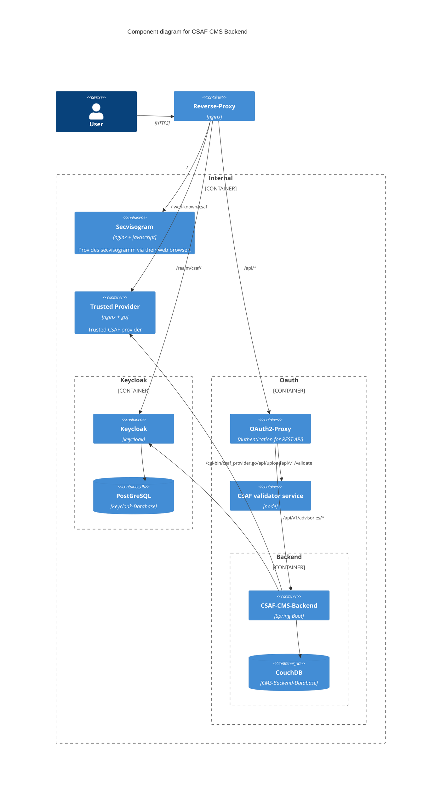

# Local development with Docker

This guide describes how to run the whole CSAF CMS Backend stack (CouchDB,
Keycloak, oauth2-proxy, the validator service, Secvisogram and the backend
itself) locally with Docker Compose. **This is the only guide you need if you
just want to try out or develop against the backend locally** — you do not
need to read the ["Getting started"](../README.md#getting-started) section
of the main README, which describes a manual/production setup without
Docker.

Please note that the following setup is for development purposes only and
should not be used in production.



## Step-by-step setup

Configuration is split across two **.env** files, each with its own
**.env.example** template:

- **`.env`** (repo root): configuration for the backend application itself
  (CouchDB connection, OIDC issuer, document templates, versioning, tracking
  IDs, workflow flags, ...). This is read both when running the backend on
  the host (`./mvnw spring-boot:run`) and by the containerized
  `backend-cms` compose service.
- **`docker/.env`**: configuration needed only to orchestrate the local
  docker compose stack itself (Keycloak, oauth2-proxy, CouchDB container
  credentials, ports, ...).

Follow these steps **in order**:

1. Copy both `.env.example` files to `.env`:

   ```shell
   cp .env.example .env
   cp docker/.env.example docker/.env
   ```

   A few values (e.g. CouchDB credentials, the backend port) intentionally
   appear in both files, with comments cross-referencing each other — keep
   them in sync if you change them.

2. [Generate a cookie secret](https://oauth2-proxy.github.io/oauth2-proxy/configuration/overview#generating-a-cookie-secret)
   and paste it into `CSAF_COOKIE_SECRET` in `docker/.env`. **This must be
   done before the first `docker compose up`.**

3. Start the stack: run `docker compose up -d --build` in folder `docker`.

4. Set up your CouchDB server: open `http://127.0.0.1:5984/_utils/#/setup`
   log in with the credentials from `docker/.env` (CSAF_COUCHDB_USER /
   CSAF_COUCHDB_PASSWORD) and run the
   [Single Node Setup](https://docs.couchdb.org/en/stable/setup/single-node.html).
   This creates databases like **_users** and stops CouchDB from spamming
   our logs (admin credentials from `docker/.env`).

5. Create a database in CouchDB with the name specified in
   `CSAF_COUCHDB_DBNAME`.

6. Keycloak is initialized automatically: on startup it imports the `csaf`
   realm, the `secvisogram` client, all client roles and the development
   test users from `docker/config/keycloak/csaf-realm.json` (via
   `--import-realm`). There is no manual setup step and no need to copy the
   client secret out of the Keycloak UI.
    - `CSAF_CLIENT_SECRET` in `docker/.env` is a **fixed, development-only
      value** (see `docker/.env.example`). Keycloak imports the realm with
      this secret and oauth2-proxy is configured with the same value, so
      both sides always match. If you change it after the first start,
      delete the Keycloak database volume (`docker/data/keycloak-db`) so
      the realm gets re-imported with the new secret.
    - Note: `--import-realm` only imports the realm if it does not already
      exist. If you change the realm file later and want it re-imported,
      remove the Keycloak database volume first: `docker compose down` and
      delete `docker/data/keycloak-db`.

7. (optional) Initialize the trusted CSAF provider:
   `docker compose up trusted-provider-setup`.
    - The folder `docker/config/trustedprovider` contains example /
      development PGP keys.
    - More details on configuring the trusted provider can be found at
      [GoCSAF](https://github.com/gocsaf/csaf).

8. (required for exports) Install
   [pandoc (tested with version 2.18)](https://pandoc.org/installing.html)
   as well as [weasyprint (tested with version 56.0)](https://weasyprint.org/)
   and make sure both are in your PATH.

9. (optional for exports) Define the path to a company logo that should be
   used in the exports through the environment variable
   `CSAF_COMPANY_LOGO_PATH`. The path can either be relative to the project
   root or absolute. See `.env.example` for an example.

10. `backend-cms` is now running. If you are actively working on backend
    code, see [Debugging the backend](#debugging-the-backend) below for the
    faster host-based workflow with IDE debugging.

You should now be able to navigate to `http://localhost/api/v1/about`, log in
with one of the users below and get a response from the server.

## Default users

| User       | Password   | Roles                                                       |
|------------|------------|-------------------------------------------------------------|
| registered | registered | **registered**                                              |
| author     | author     | registered, editor, **author**                              |
| editor     | editor     | registered, **editor**                                      |
| publisher  | publisher  | registered, editor, **publisher**                           |
| reviewer   | reviewer   | registered, **reviewer**                                    |
| auditor    | auditor    | **auditor**                                                 |
| all        | all        | **auditor, reviewer, publisher, editor, author, registred** |
| none       | none       |                                                             |

You should now also be able to access Secvisogram by navigating to `http://localhost/`.

## Debugging the backend

To run/debug the backend on the host (e.g. from an IDE) instead of in its container:

1. Stop the container: `docker compose stop backend-cms`
2. In `docker/.env`, set `CSAF_CMS_BACKEND_HOST=host.docker.internal`
3. Restart oauth2-proxy so it picks up the change: `docker compose up -d oauth2-proxy`
4. Start the backend on the host: `./mvnw spring-boot:run`

To switch back to the containerized backend, set `CSAF_CMS_BACKEND_HOST` back to
`backend-cms` and run `docker compose up -d` again.

## Accessing CouchDB

The port is defined in `docker/.env` (`CSAF_COUCHDB_PORT`, default 5984).

- CouchDB admin UI: [http://localhost:5984/_utils/#login](http://localhost:5984/_utils/#login)
- CouchDB info: [http://localhost:5984/](http://localhost:5984/)

## Building images and running from local source

Running `docker compose` from `docker/` (as above) is the quick-look path: every
service pulls a pinned/published image and nothing builds. (If you just want to
iterate on backend code without building a container at all, see
[Debugging the backend](#debugging-the-backend) above — it runs the backend
directly on the host instead.) Two subdirectories give you a build-from-source
stack instead, without touching the base setup — same `docker/.env`, `docker/data`,
and `docker/config`, just built rather than pulled:

- **`docker/dev`** — builds `backend-cms` from this repo's own source. Use this
  when you're only working on the backend:

  ```shell
  cd docker/dev
  docker compose up -d --build
  ```

- **`docker/dev-all`** — builds `backend-cms`, `secvisogram`, and the validator
  service, all from local source. Requires
  [`secvisogram`](https://github.com/secvisogram/secvisogram) and
  [`csaf-validator-service`](https://github.com/secvisogram/csaf-validator-service)
  checked out as sibling directories next to this repo (i.e. `../secvisogram` and
  `../csaf-validator-service` relative to this repo's root):

  ```shell
  cd docker/dev-all
  docker compose up -d --build
  ```

Each subdirectory's `.env` sets Compose's `COMPOSE_FILE` so that running from there
merges in that subdirectory's own `compose.build.yaml`.
You can freely switch between `docker/`, `docker/dev/`, and `docker/dev-all/` for
the same containers and volumes; it's not a separate environment, just a different
set of compose files layered on top of the same one.

[(back to top)](#local-development-with-docker)
