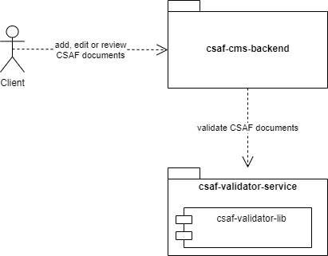
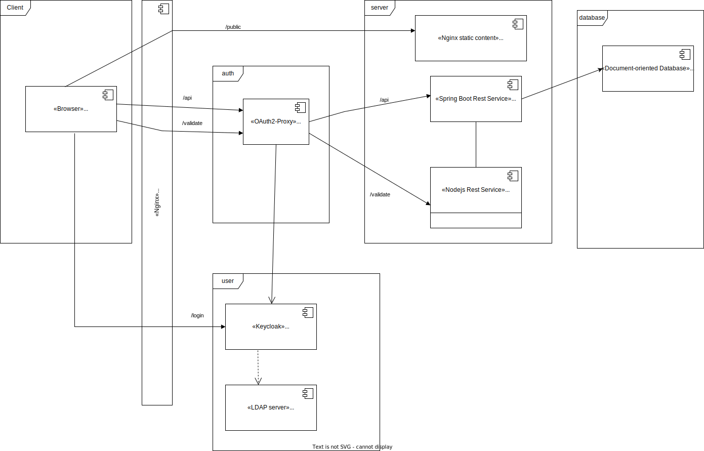
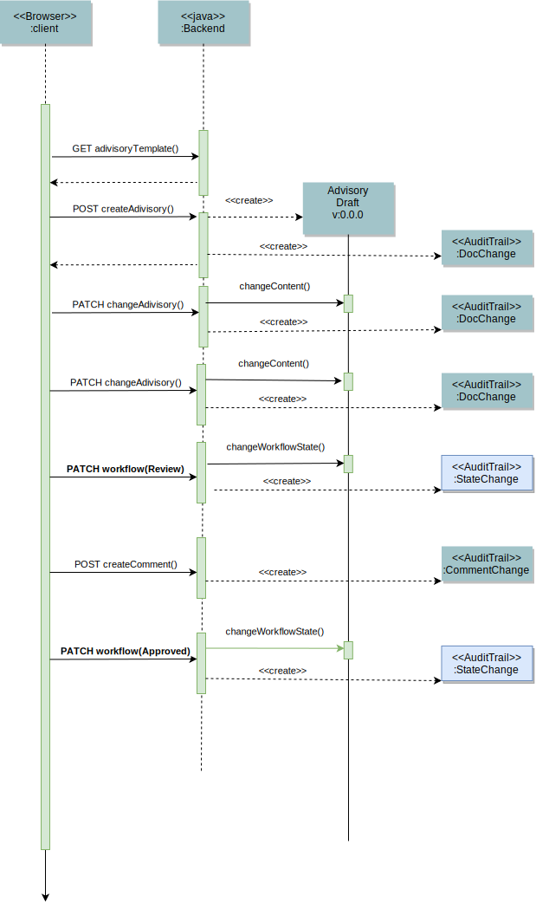
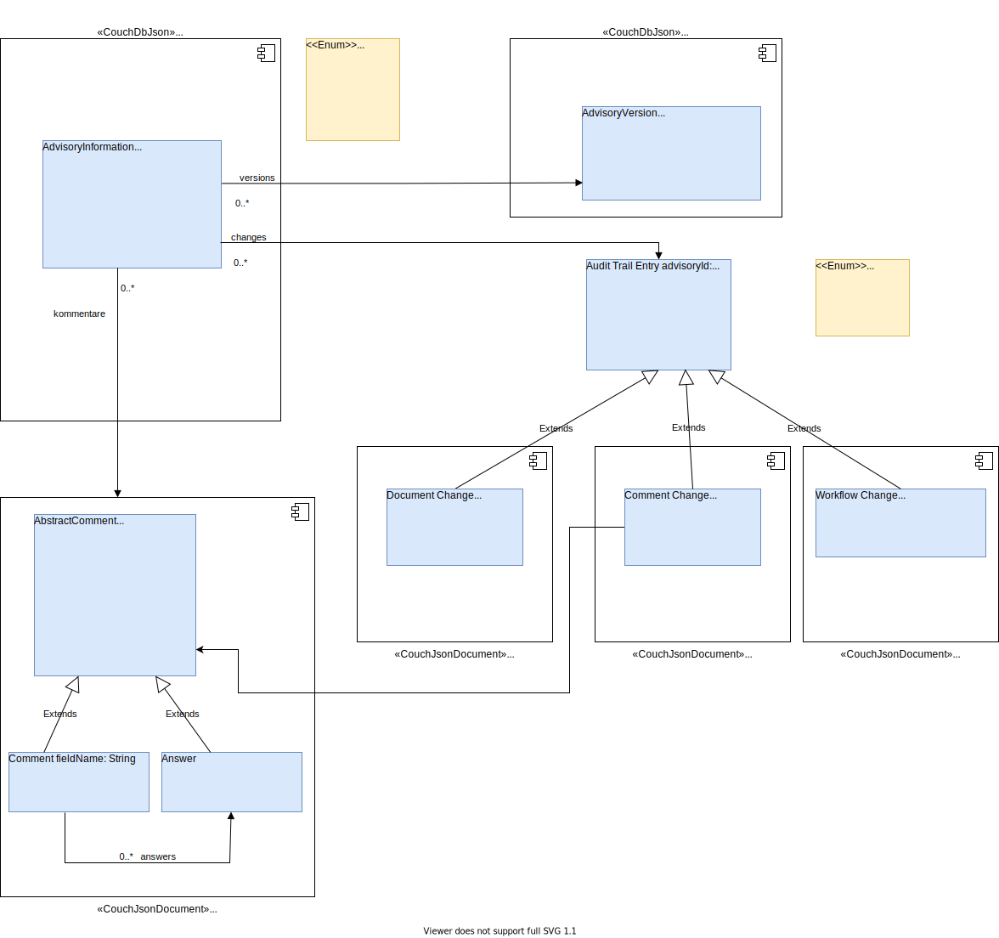
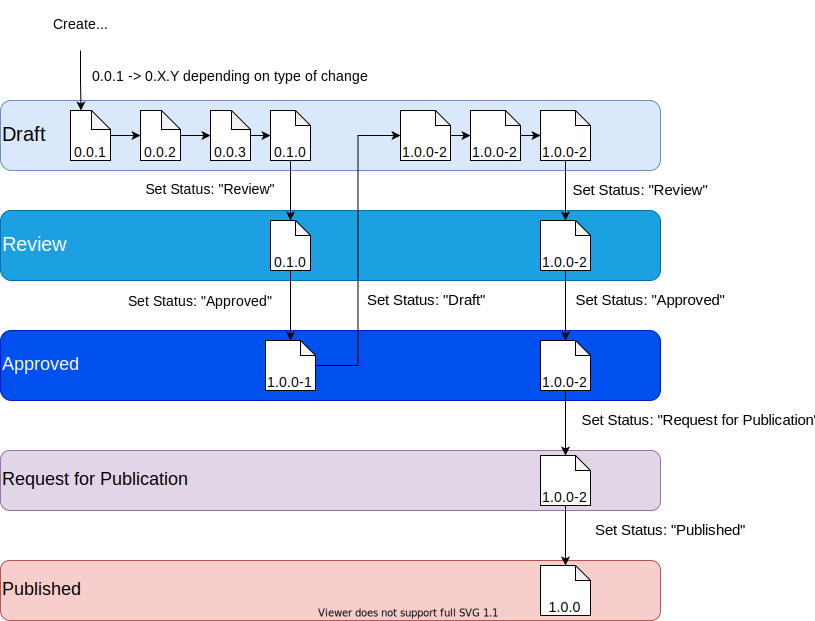

# Secvisogram 2.0 - Architecture decisions Backend and Rest interface

## 1 Introduction and Goals

This document describes the architecture decisions for the csaf-cms-backend.
This software is used to manage CSAF documents and provide a workflow to handle
different document states like 'draft' or 'published'.

### Requirements Overview

The system must provide all functionality of a CSAF management system as
described in [Common Security Advisory Framework Version 2.0](https://docs.oasis-open.org/csaf/csaf/v2.0/csd01/csaf-v2.0-csd01.html#9112-conformance-clause-12-csaf-management-system)

Additional features and requirements:

- Use a document database

- Export documents as html, markdown and pdf

- The structure of the exported document is described by a mustache html template

- It must be possible to write custom functions that generate further data which
  can then be added to the template.

- The ability to provide a company logo that is visible on the exported document

- Use Keycloak for user/group/role management and to allow LDAP integration

- Provide an API where the user can download prefilled Documents as a starting
  point for new documents

- Provide workflow functionality for the document states Draft, Review, Approved
  and Published

- Each change in a document has to be traceable. This will be done by saving the
  [JSON Patch](https://datatracker.ietf.org/doc/html/rfc6902) between each CSAF
  document version.

### Quality Goals

| Quality Category | Description                                                                            |
|------------------|----------------------------------------------------------------------------------------|
| Security         | web applications should minimize the OWASP Top 10  risks                               |
| Security         | only authorized user can interact with the server                                      |
| Correctness      | only valid CSAF-Document could be published                                            |
| Correctness      | the code coverage has tobe at least 95%                                                |
| Maintainability  | particular attention has to be paid to the maintainability in design and implementation |

TODO: Functional requirements


- Provide documentation for:

    - Data structures

    - API functionality

    - How to run/deploy the application

    - How to change the export template


### Stakeholders

| Name                                               | Expectations                                               |
| -------------------------------------------------- | ---------------------------------------------------------- |
| tschmidtb51                                        | Provides knowledge and insight into the CSAF specification |
| mfd2007                                            | Provides knowledge and insight into the CSAF specification |
| [eXXcellent solutions GmbH](https://exxcellent.de) | Develops the application                                   |

TODO: User of the system

## 2 Constraints

### Technical Constraints

|     | Constraint                   | Description                                                                                                                                                                                                                         |
| --- | ---------------------------- |-------------------------------------------------------------------------------------------------------------------------------------------------------------------------------------------------------------------------------------|
| TC1 | Implementation in Java       | Code should be implemented in a common and secure programming language. 	Therefore Java 17 is used as language for the project.                                                                                     |
| TC2 | Rest API                     | The API should be language and framework agnostic, however. It should be possible that clients can be implemented using various frameworks and languages.                                                      |
| TC3 | OS indepentent development   | It should be possible to compile and run this application on all mayor operating systems (Linux, Mac and Windows)                                                                                                                   |
| TC4 | Deployable to a Linux server | The target platform for deployment is Linux. There must be documentation available on how to deploy and run the application. Docker is not strictly required but should be provided as well. TODO: auf unterschiedlichen Platformen |

### Organizational Constraints

|     | Constraint       | Description                                                                                                                                           |
| --- | ---------------- | ----------------------------------------------------------------------------------------------------------------------------------------------------- |
| OC1 | Time schedule    | The application should be finished until ...                                                                                                          |
| OC2 | IDE independence | No special IDE should be required. Use whatever fits your workflow. The repository should therefore not contain any IDE specific configuration files. |
| OC3 | Testing          | Provide tests to ensure functional correctness. At least 95% test coverage is required.                                                               |
| OC4 | Licensing        | The software must be available under the [MIT License](https://opensource.org/licenses/MIT).                                                          |

### Conventions

|     | Constraint                 | Description                                                                                                                |
|-----|----------------------------|----------------------------------------------------------------------------------------------------------------------------|
| C1  | Architecture documentation | Provide architecture documentation by using the [arc42](https://arc42.org/) method.                                        |
| C2  | Coding conventions         | This project is using .... This is enforced through....                                                                    |
| C3  | Language                   | The language used throughout the project is american English. (code comments, documentation, ...)                          |
| C4  | Git commit conventions     | [Conventional Commits](https://www.conventionalcommits.org/en/v1.0.0/) are used for commit messages TODO:(wie secvisogram) |
| C5  | License                    | The code should be published with the MIT license                                                                          |
| C6  | Markdown Lint              | Markdown file should be checked with Markdown-lint. This should be done in Github Actions                                  |
| C7  | Eslint                     | Javascript file should be checked with Eslint. This should be done in Github Actions                                       |
| C7  | Code Reviews               | A pull request has to be reviews by another developer before it is merged to the main branch                               |
| C8  | Code coverage              | The Test coverage has to be of at least 95%                                                                                |

## 3 Context & Scope

### Business Context



The could be an editor application like the Secvisogram react application but   
also an external system that is able to access a rest api.

The Client uses the system to add, edit, delete and review CSAF-Documents.
It should be possible for the editor, to export CSAF-Documents to Markdown,
HTML or PDF.
The Client could add comments to the whole CSAF-Documents or parts of it.
Comments could be answered be other editors.
All Changes are tracked by the system.

The Client could have one of the following roles:

- Registered
- Author
- Editor
- Publisher
- Reviewer
- Auditor
- Manager
- Administrator

The Csaf-Document could have one of the following workflow states:

- Draft
- Review
- Approved
- Request for publication
- Published
  
[csaf-validator-service GIT repository](https://github.com/secvisogram/csaf-validator-service)

[csaf-validator-lib GIT repository](https://github.com/secvisogram/csaf-validator-lib)

## 4 Solutions Strategy

The Backend should be accessible from a wide range of clients implemented in different technologies.

Therefore, the Representational state transfer (**REST**) over **HTTP** is used as architectural style. HTTP is supported in nearly every language. 
For the Request Payload **JSON** is used, because it is also available on a wide range of platforms. 

**Java** is used as implementation language because it is one of the most widespread programming languages, and it is well known to the developers.

Spring boot is used as application framework, because it supports  
REST and JSON out-of-the-box. It is well documented, widely spread and integrates many other frameworks. 


As persistent storage for the CSAF-Documents the open-source document-oriented NoSQL database Apache CouchDB is
used. CouchDB uses the JSON format for storing documents and can filter JSON documents. For this reason it is a good match to CSAF-documents.

Keycloack and the OAuth2-Proxy are used for authentication and authorization.
Keycloack  uses an external system like LDAP for the user management. It is possible to integrate other sources for te user management.

## 5 Building Block View



### Components

- In the **CouchDB** all CASF-Advisories and their additional Data like the
  Audit-Trail are persisted
- The **CSAF-Validator** is a NodeJs application that provides the "CSAF extended
  validator" as REST-Service
- The **CSAF-Backend** is a Spring Boot Application that provides the REST-Services
  for the functions for the CSAF management system
- The **CSAF-Backend** uses the CouchDB to persist and read the CSAF-Advisories
  and the additional data
- The **CSAF-Backend** uses the CSAF-Validator to validate CSAF-Advisories
- The Secvisogram **React Application** is hosted on a nginx Webserver that
  provides the static data for the React Client
- The **Authentication Proxy** is a OAuth2-Proxy the handles all requests that
  need authentication
- The **Keycloak-Authentication** is a Keycloak server, that is responsible for
  authenticating users
- The **Keycloak-Authentication** uses the **User Management** to retrieve
  information about user and roles
- The **User Management** provides user information to the Keycloak server
- The **React Client** is a Single Page Application that runs in the browser
  It uses the CSAF-Backend to save and retrieve CSAF Advisories
  It uses the CSAF-Validator to validate CSAF Advisories

### Integration keycloack

- The Oauth2-Proxy that serves as a proxy to the backend for all Request that need
  authentication.
- The CSAF-Backend and the CSAF-Validator don’t have to implement the necessary
  OAuth flows and therefore, don’t need to manage the access tokens.
- The Oauth2-Proxy uses Keycloak to get the authentication Information
- Keycloak gets the user and role information from LDAP
- User management is done in LDAP Keycloak handles the login
- Information about the logged-in user and his role are provided to the
  CSAF-Backend by JSON Web Tokens (JWT)

## 6 Runtime View

### Create Comments


### Workflow Advisory



## 7. Deployment View

## 8 Concepts

### Datamodel

At the current state a CSAF document will be saved as one object in the database.
This object will also contain the owner as well as the workflow status. Other
relevant information like Comments or the audit trail will be stored separately.



#### AdvisoryInformation

Holds the current version of a CSAF advisory

| Field        | Description                                        |
| ------------ |----------------------------------------------------|
| advisoryId   | Unique Id of the advisory                          |
| docVersion   | The current Version String of the advisory         |
| worklowState | The workflow state of the advisory                 |
| owner        | The current owner of the advisory                  |
| csafDocument | The CSAF-Document as Json with additional comments |

#### AdvisoryVersion

Holds the version history of a CSAF advisory

| Field        | Description                        |
| ------------ | ---------------------------------- |
| docVersion   | The Version String of the advisory |
| csafDocument | The CSAF-Document as Json          |

#### WorkflowState

The workflow state of the advisory.  
Possible values:

- Draft

- Review

- Approved

- RfPublication

- Published

The workflow state is not part of the CSAF-Document.

The CSAF-document holds a state in: `/documents/tracking/status`.  
But this one has the enum values: `draft, final, interim`

#### Comment

Hold all comments and answers to a CSAF Advisory.

|             |                                                                                                                                                |
|-------------|------------------------------------------------------------------------------------------------------------------------------------------------|
| Field       | Description                                                                                                                                    |
| commentId   | The unique Id of the comment                                                                                                                   |
| docVersion  | Reference to the version of the CSAF AdvisoryInformation                                                                                       |
| changedBy   | User that created/last changed  the comment                                                                                                    |
| changedAt   | Timestamp when the comment was created / last changed                                                                                          |
| fieldName   | null - when the comment belong to whole csaf object or the concrete field name in the csaf object, when the comments belong o a specific field |
| commentText | The text of the comment as string with CR/LF                                                                                                   |
| answers     | List of answers to the comment                                                                                                                 |

A comment can reference either a document as a whole, a specific object or value
in the document. Since the CSAF standard has no concept for unique identifiers
inside the document we need to persist this relation somehow without
unnecessarily adding identifiers to each object. Furthermore we need to remove
these IDs before sending the document to the validator service.

The ids of the Comments are referenced from the CSAF Document objects.
When the comments belongs to an dedicated field and not the whole object,
the fieldName in the objects is used to specify the concrete value.

We archive this by adding a $comment value to the document where the user adds a
comment.

**Example:**

```json
{
  "$comment": [22, 34],
  "document": {
    "$comment": [44, 55],
    "category": "generic_csaf",
    "csaf_version": "2.0",
    "publisher": {
      "$comment": [56, 57],
      "category": "coordinator",
      "name": "exccellent",
      "namespace": "https://exccellent.de"
    },
    "title": "TestRSc",
    "tracking": {
      "current_release_date": "2022-01-11T11:00:00.000Z",
      "id": "exxcellent-2021AB123",
      "initial_release_date": "2022-01-12T11:00:00.000Z",
      "revision_history": [
        {
          "$comment": [58, 59],
          "date": "2022-01-12T11:00:00.000Z",
          "number": "0.0.1",
          "summary": "Test rsvSummary"
        },
        {
          "$comment": [60, 61],
          "date": "2022-01-12T11:00:00.000Z",
          "number": "0.0.1",
          "summary": "Test rsvSummary"
        }
      ],
      "status": "draft",
      "version": "0.0.1",
      "generator": {
        "date": "2022-01-11T04:07:27.246Z",
        "engine": {
          "version": "1.10.0",
          "name": "Secvisogram"
        }
      }
    },
    "acknowledgments": [
      {
        "names": [
          "Alice",
          "Bob"
        ],
        "organization": "exxcellent contribute",
        "summary": "Summary 1234",
        "urls": [
          "https://exccellent.de",
          "https://github.com/secvisogram/csaf-cms-backend"
        ]
      }
    ]
  }
}
```

#### Audit Trail

In the Audit Trail all changes to a CSAF Advisory, to comments as well as
workflow changes are recorded.

There are 3 Types of changes: Document Change, Comment Change and Workflow
Change. They all have he same superclass Audit Trail Entry

#### Audit Trail Entry

Superclass of all changes

| Field      | Description                                              |
| ---------- | -------------------------------------------------------- |
| advisoryId | Reference to the id of the CSAF AdvisoryInformation      |
| docVersion | Reference to the version of the CSAF AdvisoryInformation |
| user       | User that has done the change                            |
| createdAt  | Timestamp when the entries has been created              |

#### Document Change

| Field         | Description                                                                                                    |
| ------------- | -------------------------------------------------------------------------------------------------------------- |
| diff          | the changes to the Previous version in JsonPatch Format ([JSON Patch \| jsonpatch.com](http://jsonpatch.com/)) |
| oldDocVersion | Reference to the old version of the CSAF AdvisoryInformation                                                   |
| changeType    | Created or Update                                                                                              |

#### Workflow Change

Logs the change of the workflow state of the CSAF Advisory

| Field    | Description                                 |
| -------- | ------------------------------------------- |
| oldState | The old workflow state of the CSAF Advisory |
| newState | The new workflow state of the CSAF Advisory |

#### Comment change

Logs changes in comments or answers

| Field      | Description                               |
| ---------- | ----------------------------------------- |
| diff       | The changed text in the comment or answer |
| commentId  | Reference to the id of the comment        |
| changeType | Created or Update                         |

### Export

### Export Templates

CSAF documents exporters to the formats html, pdf and markdown have to be
available. To export a document a [Mustache](https://mustache.github.io/) html
template is used. This provides the document structure and can be further
converted into pdf or markdown if needed. This also reduces the maintenance
since only one template has to be maintained. The template itself is stored as
a file on the server and can be modified without a redeploy of the backend
application. A image containing a company logo can also be stored together with
the export template. It will be rendered on the first page of the document when
exporting.

### Document Templates

A user of this system should be able to download prefilled CSAF documents as
templates for new CSAF documents. This first implementation will use a folder
to store all available templates. All json documents in this folder will be
available as a template. An API will list all available templates to the user.

### Edit Workflow

#### Wokflow before first release



- At first a initial advisory is created which workflow state is set to Draft
- This advisory could be changed several times in State Draft. Depending on the
  type of change the version of the advisory is increased as patch or minor
  release.   
- When all changes are done, the set workflow state is set to Review
- After the review was successfully the workflow state is set to Approved.
  The version is set to 1.0.0-1
- This Prerelease could be used to distribute the advisory to partners.
  (restricted use)
- The advisory could be set to the workflow state draft to add the feedbacks to 
  the interim version
- In the state Approved the advisory could also set to workflow state "Request 
  for Publication"
- After all the workflow state is set to Published and the version to 1.0.0 


## 9 Design Decisions

### Add comments to CSAF document

#### Problem

It should be possible to add comments to the csaf document. The comment could be
for the whole document or for a specific area in the document.
Since the CSAF standard has no concept for unique identifiers inside the
document we need to persist this relation somehow without unnecessarily adding
identifiers to each object.

#### Decision

The ids of the Comments are referenced from the CSAF Document objects.
When the comments belongs to an dedicated field and not the whole object,
the fieldName in the objects is used to specify the concrete value.

We archive this by adding a $comment value to the document where the user adds a
comment.

#### Consequences

- The algorithm to add comments is very simple
- The comments are referenced proper even some parts of the document are deleted
- The size of the casf document is only slightly increased be the comments
- The comments have to be removed before the csaf document is validated
- The rest client has to manage the id of the comments
- The creation of the comments and the save of the the csaf documents are done
  in different transaction. We need a job cleanup for accidentally created
  comments

## 10 Quality Requirements

## 11 Risks and Technical Debts

### Document size limit is 8MB

At the current stage each document is stored as a single document in the
database. At the moment CouchDB has a limit of 8MB per document. Since the
current focus is the development of a user friendly
[editor](https://github.com/secvisogram/secvisogram) for CSAF documents this
should be enough.

In the future the documents can be split up and thus remove this restriction.
This will also require a change to the API.

## 12 Glossary