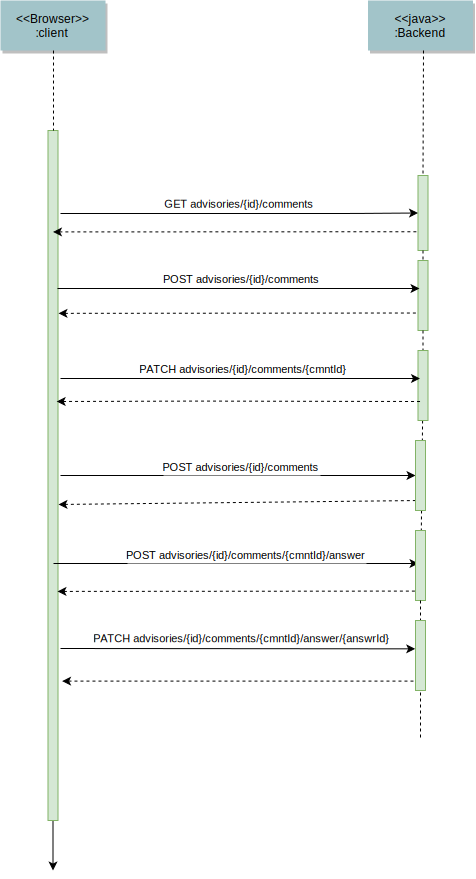

# Secvisogram 2.0 - Architecture and REST interface

## 1 Introduction and Goals

This document describes the architecture decisions for the csaf-cms-backend.
This software is used to manage CSAF documents and provide a workflow to handle
different document states like `Draft` or `Published`.

### Requirements Overview

The system must provide all functionality of a CSAF management system as
described in [Common Security Advisory Framework Version 2.0](https://docs.oasis-open.org/csaf/csaf/v2.0/csd01/csaf-v2.0-csd01.html#9112-conformance-clause-12-csaf-management-system)

Additional features and requirements:

- Use a document database

- Export documents as HTML, Markdown and PDF

- The structure of the exported document is described by a mustache html template

- It must be possible to write custom functions that generate further data which
  can then be added to the template.

- The ability to provide a company logo that is visible on the exported document

- Use Keycloak for user/group/role management and to allow LDAP integration

- Provide an API where the user can download prefilled documents as a starting
  point for new documents

- Provide workflow functionality for the document states `Draft`, `Review`,
  `Approved` and `Published`

- Each change in a document has to be traceable. This will be done by saving the
  [JSON Patch](https://datatracker.ietf.org/doc/html/rfc6902) between each CSAF
  document version.

### Quality Goals

| Quality Category | Description                                                                             |
|------------------|-----------------------------------------------------------------------------------------|
| Security         | web applications should minimize the OWASP Top 10 risks                                 |
| Security         | only authorized users can interact with the server                                      |
| Correctness      | only valid CSAF-Document can be published                                               |
| Correctness      | the code coverage has to be at least 95%                                                |
| Maintainability  | particular attention has to be paid to the maintainability in design and implementation |

TODO: Functional requirements

Provide documentation for:

- [ ] Data structures
- [ ] API functionality
- [ ] How to run/deploy the application
- [ ] How to change the export template

### Stakeholders

| Name                                               | Expectations                                               |
|----------------------------------------------------|------------------------------------------------------------|
| tschmidtb51                                        | Provides knowledge and insight into the CSAF specification |
| mfd2007                                            | Provides knowledge and insight into the CSAF specification |
| [eXXcellent solutions GmbH](https://exxcellent.de) | Develops the application                                   |

TODO: User of the system

## 2 Constraints

### Technical Constraints

|     | Constraint                   | Description                                                                                                                                                                                                                         |
|-----|------------------------------|-------------------------------------------------------------------------------------------------------------------------------------------------------------------------------------------------------------------------------------|
| TC1 | Implementation in Java       | Code should be implemented in a common and secure programming language. Therefore Java 17 is used as language for the project.                                                                                                      |
| TC2 | Rest API                     | The API should be language and framework agnostic, however. It should be possible that clients can be implemented using various frameworks and languages.                                                                           |
| TC3 | OS independent development   | It should be possible to compile and run this application on all mayor operating systems (Linux, Mac and Windows).                                                                                                                  |
| TC4 | Deployable to a Linux server | The target platform for deployment is Linux. There must be documentation available on how to deploy and run the application. Docker is not strictly required but should be provided as well. TODO: auf unterschiedlichen Platformen |

### Organizational Constraints

|     | Constraint       | Description                                                                                                                                           |
|-----|------------------|-------------------------------------------------------------------------------------------------------------------------------------------------------|
| OC1 | Time schedule    | The application should be finished until ...                                                                                                          |
| OC2 | IDE independence | No special IDE should be required. Use whatever fits your workflow. The repository should therefore not contain any IDE specific configuration files. |
| OC3 | Testing          | Provide tests to ensure functional correctness. At least 95% test coverage is required.                                                               |
| OC4 | Licensing        | The software must be available under the [MIT License](https://opensource.org/licenses/MIT).                                                          |

### Conventions

|     | Constraint                 | Description                                                                                                                                                                                              |
|-----|----------------------------|----------------------------------------------------------------------------------------------------------------------------------------------------------------------------------------------------------|
| C1  | Architecture documentation | Provide architecture documentation by using the [arc42](https://arc42.org/) method.                                                                                                                      |
| C2  | Coding conventions         | This project is using .... This is enforced through....                                                                                                                                                  |
| C3  | Language                   | The language used throughout the project is american English. (code comments, documentation, ...)                                                                                                        |
| C4  | Git commit conventions     | [Conventional Commits](https://www.conventionalcommits.org/en/v1.0.0/) are used for commit messages TODO:(wie secvisogram). <br/> GitHub issues shall be referenced in commit messages where applicable. |
| C5  | License                    | The code should be published under the MIT license                                                                                                                                                       |
| C6  | Markdown Lint              | Markdown files should be checked with Markdown-lint. This should be done in Github Actions                                                                                                               |
| C7  | Eslint                     | Javascript files should be checked with Eslint. This should be done in Github Actions                                                                                                                    |
| C7  | Code Reviews               | A pull request has to be reviewed by another developer before it is merged to the main branch                                                                                                            |
| C8  | Code coverage              | The Test coverage has to be of at least 95%                                                                                                                                                              |

## 3 Context & Scope

### Business Context


There could be an editor application like the
[secvisogram](https://github.com/secvisogram/secvisogram/) react application
but also an external system that is able to access a REST API.

The client uses the system to add, edit, delete and review CSAF-Documents.
It should be possible for the editor to export CSAF documents to Markdown,
HTML or PDF.
The Client could add comments to the whole CSAF document or parts of it.
Comments could be answered by other editors.
All Changes are tracked by the system.

#### Roles

The Client could have one of the following roles:

##### Role: Registered

- is allowed to list and view all CSAF documents in `Published` status

##### Role: Author

- inherits the rights of the "Registered" role
- may list, view, edit and delete own (by the user) CSAF documents in `Draft`
  status and delete them
- may view and reply to comments on CSAF documents that he/she is allowed to
  view and edit
- may create new CSAF documents
- may change the status of own CSAF documents from `Draft` to `Review`
- may view the status of own CSAF documents

##### Role: Editor

- inherits the rights of the "Author" role
- may list, view, edit and delete all Advisories in `Draft` status
- may change the status of all CSAF documents from `Draft` to `Review`
- may view the status of all CSAF documents

##### Role: Publisher

- inherits the rights of the "Editor" role
- may list and view all CSAF documents in `Approved` status.
- may change the status of all CSAF documents from `Approved` to `Published`
  (this change of status may also happen time-based, i.e. by setting a publishing date).

##### Role: Reviewer

- inherits the rights of the "Registered" role
- may list and view all CSAF documents in the status `Review` and not created by
  the user, list and view them.
- May view and create comments on CSAF documents.
- may change the status from `Review` to `Draft` or `Approved`.

##### Role: Auditor

- can list and view all CSAF documents
- can list and view all versions of CSAF documents
- can list and view all comments and replies to CSAF documents
- can list and view all status changes to CSAF documents
- may list and view the audit trail for all CSAF documents.

##### Role:  Manager

- inherits the rights of the "Publisher" role
- may delete all advisories (regardless of status).
- may perform user management (including changing the ownership of CSAF documents)
  up to and including the "Publisher" role

##### Role:  Administrator

- may create users, roles
- may configure settings
- may change the template
- may perform user management (including change of ownership of CSAF documents)
  for all roles

#### Workflow States

The CSAF document could have one of the following workflow states:

- `Draft`
- `Review`
- `Approved`
- `RfPublication`
- `Published`

#### Audit Trail recording

An audit trail shall be maintained for each CSAF document. The audit trail
records who made which changes to the CSAF document and when.
This includes creation, editing, status changes, comments and responses to
them, including the performing user.

#### Comments

There must be the option to post comments for a CSAF document. A comment
must contain at least the user who created it, the time and a free text. A comment
can be general to the CSAF document or refer to a line or area of a CSAF document.
There must be a possibility to reply to the comment.

#### Export

There must be transformations available for export to the following formats:
HTML, PDF amd Markdown. These allow the user to convert the CSAF document into
different formats. As a configuration option at least, the company logo is
available and a template. The Contractor must create a template.
It must be possible to adapt a template as required.
Detailed documentation is required for this purpose.

#### Validation of CSAF Documents

The CSAF validator service shall be used to validate CSAF documents.
For this, the CSAF validator service is used.
Further details on this is supplied in the documentation of the
[csaf-validator-service](https://github.com/secvisogram/csaf-validator-service)
which provides an interface for the
[csaf-validator-lib](https://github.com/secvisogram/csaf-validator-lib).

## 4 Solutions Strategy

The Backend should be accessible from a wide range of clients implemented in
different technologies.

Therefor, the Representational state transfer (**REST**) over **HTTP** is used
as architectural style. HTTP is supported in nearly every language.
For the Request Payload **JSON** is used, because it is also available on
a wide range of platforms.

**Java** is used as implementation language because it is one of the most
widespread programming languages, and it is well known to the developers.

[Spring Boot](https://spring.io/projects/spring-boot) is used as application
framework, because it supports REST and JSON out-of-the-box. It is well
documented, widely spread and integrates many other frameworks.

### Persistent storage

As persistent storage for the CSAF-Documents the open-source document-oriented
NoSQL database [Apache CouchDB](https://couchdb.apache.org/) is used. CouchDB
uses the JSON format for storing documents and can filter JSON documents. For
this reason it is a good match to CSAF-documents.

### Authorization, User management

Keycloak and the OAuth2-Proxy are used for authentication and authorization.
Keycloak uses an external system like LDAP for the user management.
It is possible to integrate other sources for the user management.

### Export with Mustache

For the export of documents we use [Mustache](https://mustache.github.io/).
Mustache is a template-based language available in many programming languages.
It is planned to use one template for all export types to minimize the
maintenance effort and to avoid inconsistencies.

### Audit trail

For the audit trail, only the changes between the CSAF documents are logged.
We use [JSON Patch](https://datatracker.ietf.org/doc/html/rfc6902) to track
differences between JSON documents.

## 5 Building Block View


### Components

- In the **CouchDB** all CASF-Advisories and additional data like the audit trail
  are persisted
- The **CSAF-Validator** is a NodeJs application that provides the "CSAF extended
  validator" as REST-Service
- The **CSAF-Backend** is a Spring Boot Application that provides the REST-Services
  for the functions for the CSAF management system
- The **CSAF-Backend** uses the CouchDB to persist and read the CSAF-Advisories
  and the additional data
- The **CSAF-Backend** uses the CSAF-Validator to validate CSAF-Advisories
- The Secvisogram **React Application** is hosted on a nginx Webserver that
  provides the static data for the React Client
- The **Authentication Proxy** is an OAuth2-Proxy that handles all requests that
  need authentication
- The **Keycloak-Authentication** is a Keycloak server that is responsible for
  authenticating users
- The **Keycloak-Authentication** uses the **User Management** to retrieve
  information about users and roles
- The **User Management** provides user information to the Keycloak server
- The **React Client** is a Single Page Application that runs in the browser
  It uses the CSAF-Backend to save and retrieve CSAF Advisories 
  It uses the CSAF-Validator to validate CSAF Advisories

### Integration keycloak

- Keycloak is used as Oauth2-Proxy that serves as a proxy to the backend for
  all Request that need authentication
- The CSAF-Backend and the CSAF-Validator don’t have to implement the necessary
  OAuth flows and therefor don’t need to manage the access tokens.
- The Oauth2-Proxy uses Keycloak to get the authentication Information
- Keycloak gets the user and role information from LDAP
- User management is done in LDAP, Keycloak handles the login
- Information about the logged-in user and his role are provided to the
  CSAF-Backend by JSON Web Tokens (JWT)

## 6 Runtime View

### Create Comments



### Workflow Advisory


## 7. Deployment View

## 8 Concepts

### Datamodel

At the current state a CSAF document will be saved as one object in the database.
This object will also contain the owner as well as the workflow status. Other
relevant information like comments or the audit trail will be stored separately.


#### AdvisoryInformation

Holds the current version of a CSAF advisory

| Field            | Description                                               |
|------------------|-----------------------------------------------------------|
| `advisoryId`     | unique ID of the advisory                                 |
| `docVersion`     | the current version string of the advisory                |
| `publishingDate` | from this date, the state `Published` is valid            |
| `workflowState`  | the workflow state of the advisory                        |
| `owner`          | the current owner of the advisory                         |
| `csafDocument`   | the CSAF document in JSON format with additional comments |

#### AdvisoryVersion

Holds the version history of a CSAF advisory

| Field          | Description                        |
|----------------|------------------------------------|
| `docVersion`   | the version string of the advisory |
| `csafDocument` | the CSAF document in JSON format   |

#### WorkflowState

The workflow state of the advisory.  
Possible values:

- `Draft`
- `Review`
- `Approved`
- `RfPublication`
- `Published`

The workflow state is not part of the CSAF document.

The CSAF document also holds a state in: `/documents/tracking/status`.
This field has the enum values: `draft`, `final`, `interim` which are not
sufficient to represent the full workflow.

#### Comment

Hold all comments and answers to a CSAF Advisory.

| Field         | Description                                                                                                                                                        |
|---------------|--------------------------------------------------------------------------------------------------------------------------------------------------------------------|
| `commentId`   | The unique ID of the comment                                                                                                                                       |
| `docVersion`  | Reference to the version of the CSAF AdvisoryInformation                                                                                                           |
| `changedBy`   | User that created/last changed the comment                                                                                                                         |
| `changedAt`   | Timestamp when the comment was created/last changed                                                                                                                |
| `fieldName`   | `null` - if the comment belongs to the whole CSAF object, the concrete field name to which the comment belongs otherwise (e.g. `document.aggregate_severity.text`) |
| `commentText` | The text of the comment as string with CR/LF                                                                                                                       |
| `answers`     | List of answers to the comment                                                                                                                                     |

A comment can reference either a document as a whole, a specific object or value
in the document. Since the CSAF standard has no concept for unique identifiers
inside the document we need to persist this relation somehow, without
unnecessarily adding identifiers to each object. Furthermore, we need to remove
these IDs before sending the document to the validator service.

The IDs of the Comments are referenced from the CSAF document objects.
When the comment belongs to a dedicated field and not the whole object,
the `fieldName` in the objects is used to specify the concrete value.

We archive this by adding a `$comment` value to the document where the user adds
a comment.

**Example:**

```json
{
  "$comment": [22, 34],
  "document": {
    "$comment": [44, 55],
    "category": "generic_csaf",
    "csaf_version": "2.0",
    "publisher": {
      "$comment": [56, 57],
      "category": "coordinator",
      "name": "exccellent",
      "namespace": "https://exccellent.de"
    },
    "title": "TestRSc",
    "tracking": {
      "current_release_date": "2022-01-11T11:00:00.000Z",
      "id": "exxcellent-2021AB123",
      "initial_release_date": "2022-01-12T11:00:00.000Z",
      "revision_history": [
        {
          "$comment": [58, 59],
          "date": "2022-01-12T11:00:00.000Z",
          "number": "0.0.1",
          "summary": "Test rsvSummary"
        },
        {
          "$comment": [60, 61],
          "date": "2022-01-12T11:00:00.000Z",
          "number": "0.0.1",
          "summary": "Test rsvSummary"
        }
      ],
      "status": "draft",
      "version": "0.0.1",
      "generator": {
        "date": "2022-01-11T04:07:27.246Z",
        "engine": {
          "version": "1.10.0",
          "name": "Secvisogram"
        }
      }
    },
    "acknowledgments": [
      {
        "names": [
          "Alice",
          "Bob"
        ],
        "organization": "exxcellent contribute",
        "summary": "Summary 1234",
        "urls": [
          "https://exccellent.de",
          "https://github.com/secvisogram/csaf-cms-backend"
        ]
      }
    ]
  }
}
```

#### Audit Trail

In the audit trail all changes to a CSAF advisory, to comments as well as
workflow changes are recorded.

There are 3 Types of changes: document change, comment change and workflow
change. They all have the same superclass `AuditTrailEntry`

#### Audit Trail Entry

Superclass of all changes

| Field        | Description                                              |
|--------------|----------------------------------------------------------|
| `advisoryId` | Reference to the ID of the CSAF AdvisoryInformation      |
| `docVersion` | Reference to the version of the CSAF AdvisoryInformation |
| `user`       | User that has done the change                            |
| `createdAt`  | Timestamp when the entries has been created              |

#### Document Change

| Field           | Description                                                                                   |
|-----------------|-----------------------------------------------------------------------------------------------|
| `diff`          | the changes to the previous version in JsonPatch Format ([JSON Patch](http://jsonpatch.com/)) |
| `oldDocVersion` | reference to the old version of the CSAF `AdvisoryInformation`                                |
| `changeType`    | `created` or `updated`                                                                        |

#### Workflow Change

Logs the change of the workflow state of the CSAF Advisory

| Field      | Description                                 |
|------------|---------------------------------------------|
| `oldState` | the old workflow state of the CSAF document |
| `newState` | the new workflow state of the CSAF document |

#### Comment change

Logs changes in comments or answers

| Field        | Description                               |
|--------------|-------------------------------------------|
| `diff`       | the changed text in the comment or answer |
| `commentId`  | reference to the ID of the comment        |
| `changeType` | `created` or `updated`                    |

### Exports

### Export Templates

CSAF document exporters to the formats HTML, PDF and Markdown have to be
available. To export a document a [Mustache](https://mustache.github.io/) html
template is used. This provides the document structure and can be further
converted into PDF or Markdown if needed. This also reduces maintenance work
since only one template has to be maintained. The template itself is stored as
a file on the server and can be modified without a re-deployment of the backend
application. An image containing a company logo can also be stored together with
the export template. It will be rendered on the first page of the document when
exporting.

#### Example: Generation of HTML with Mustache

##### Mustache Template

```html
<div class="starter-template">
    {{#document}}
        <h1>{{title}}</h1>
        <h3>{{category}}</h3>
        <h3>{{csaf_version}}</h3>
        {{#acknowledgments}}
            <h4>{{organization}}</h4>
            <div>{{summary}}</div>
            {{#urls}}
                <a>{{this}}</a>
            {{/urls}}
        {{/acknowledgments}}
    {{/document}}
</div>
```

##### CSAF Document

```json
{
  "document": {
    "category": "generic_csaf",
    "csaf_version": "2.0",
    "publisher": {
    "category": "coordinator",
    "name": "exccellent",
    "namespace": "https://exccellent.de"
  },
  "title": "TestRSc",
  "tracking": {
  },
  "acknowledgments": [
    {
      "names": [],
      "organization": "exxcellent contribute",
      "summary": "Summary 1234",
      "urls": [
        "https://exccellent.de",
        "https:/heise.de"
      ]
    }
  ]
  }
}
```

##### Generated result

```html
<div class="container">
  <div class="starter-template">
        <h1>TestRSc</h1>
        <h3>generic_csaf</h3>
        <h3>2.0</h3>
            <h4>exxcellent contribute</h4>
            <div>Summary 1234</div>
                <a>https://exccellent.de/</a>
                <a>https:/heise.de/</a>
  </div>
</div>
```

### Document Templates

A user of this system should be able to download prefilled CSAF documents as
templates for new CSAF documents. This first implementation will use a folder
to store all available templates. All JSON documents in this folder will be
available as a template. An API will list all available templates to the user.

### Advisory Workflow

#### Workflow before first release


- First, an initial advisory is created with workflow state set to `Draft`
- This advisory could be changed several times in state `Draft`. Depending on the
  type of change the version of the advisory is increased as patch or minor
  release.
- When all changes are done, the workflow state is set to `Review`
- After the review was successful the workflow state is set to `Approved` and the
  version is set to `1.0.0-1`
- This pre-release could be used to distribute the advisory to partners.
  (restricted use)
- The advisory could be set to the workflow state `Draft` to add feedback to
  the interim version
- In the state `Approved` the advisory could also set to workflow state `RfPublication`
  ("Request for Publication")
- In the end, the workflow state is set to `Published` and the version is set to `1.0.0`

#### Versioning

The backend is using Semantic versioning in the form `X.Y.Z`.
see:
[CSAF semantic version](https://docs.oasis-open.org/csaf/csaf/v2.0/cs01/csaf-v2.0-cs01.html#31112-version-type---semantic-versioning)
`X` is the major version, `Y` is the minor version, and `Z` is the patch version.
Major version zero (`0.y.z`) is for initial development before the `initial_release_date`.
Version `1.0.0` defines the initial public release

A pre-release version is denoted by appending a hyphen and a number
A pre-release version indicates that the version is unstable and might not
satisfy the intended compatibility requirements as denoted by its associated
normal version.

#### Backend States


##### Workflow Status: Not Created 

The editor loads a template from the server and starts editing a new advisory.
Afterwards the new advisory is pushed to the server.

_Possible actions_

- _createCsafDocument_
  - create new advisory in db 
  - set version to 0.0.1 
  - set workflow state to "Draft"

#### Workflow State: Draft

The editor edits the advisory several times, adds comments and answers questions.

_Possible actions_
| workflow state  | release state         |
|-----------------|-----------------------|
| `Draft`         | not publicly released |

- _changeCsafDocument_
  - save changes in db
  - increase minor or patch version depending on changes
- _changeWorkflowState to "Review"_
  -  set workflow state of the advisory "Review"
- _deleteAdvisory_
  - removes advisory from system
| REST Transition                           | Actions on server                                                             |
|-------------------------------------------|-------------------------------------------------------------------------------|
| `changeCsafDocument`                      | save changes in db <br/> increase minor or patch version depending on changes |
| `changeWorkflowState` to `Review`         | change workflow state to `Review`                                             |
| `changeWorkflowState` other than `Review` | - not possible -                                                              |
| add or change comment                     | create/update comment for advisory                                            |
| `deleteAdvisory`                          | removes advisory from system                                                  |


#### Workflow State: Review

When the editor has finished editing the advisory the document is ready for review.
The Reviewer could approve the advisory or give the document back to the editor.
When the document is in workflow state `Approved` a pre-release version is created.

_Possible actions_

- _changeWorkflowState to "Draft"_
  - change workflow state to "Approved"
- _changeWorkflowState to "Review"_
  -  set workflow state of the advisory "Approved", Set version (see below)
- _add and change comments and answers_
  - create/update comment/answer for an advisory


A prerelease version number is assigned during the status transition to approved.
If the previous version was < 1.0.0, the new version is 1.0.0-1.
If the previous version was >= 1.0.0, a distinction is made between whether the previous
version was already a prerelease version or not.
If yes, the prerelease counter will be increased by 1, if
not, the prerelease counter is set to 1.


#### Workflow State: Approved

In the state `Approved` the Publisher has 2 options:

1. distribute the pre-release version of the advisory to partners
   and set the workflow state back to `Draft`
2. set the state of the advisory to `RfPublication`

_Possible actions_

- _`changeWorkflowState` to `Draft`_
  - change workflow state to `Draft`, set version to 1.0.0-x
- _changeWorkflowState to "RfPublication"_
  -  set workflow state of the advisory `RfPublication`
- _createNew DocVersion_
  - set the version of the advisory to  


#### Workflow State: RfPublication

_Possible actions_

- _publish (changeWorkflowState to "Published")_
  - change workflow state to "Published"


#### Workflow Step: Published


- _createNewDocVersion (changeWorkflowState to "Draft")_
  - change workflow state to "Published"


TODO REST-API:
Service: create/save advisory, change workflow state.
Beim Speichern kann sich die Version des Dokuments ändern. Deswegen muss nach
 dem Ändern das Dokument im Client neu geladen werden. Die zu vergebende Version
  ist abhängig von den Änderungen im dokument und dem aktuellen Status bzw. der
   aktuellen Version des Dokuments.

Service: change workflow state


## 9 Design Decisions

### Add comments to CSAF document

#### Problem

It should be possible to add comments to the CSAF document. The comment could be
for the whole document or for a specific area in the document.
Since the CSAF standard has no concept for unique identifiers inside the
document we need to persist this relation somehow without unnecessarily adding
identifiers to each object.

#### Decision

The ids of the Comments are referenced from the CSAF Document objects.
When the comment belongs to a dedicated field and not the whole object,
the fieldName in the objects is used to specify the concrete value.

We archive this by adding a $comment value to the document where the user adds a
comment.

#### Consequences

- The algorithm to add comments is very simple
- The comments are referenced proper even some parts of the document are deleted
- The size of the casf document is only slightly increased be the comments
- The comments have to be removed before the CSAF document is validated
- The rest client has to manage the id of the comments
- The creation of comments and saving the CSAF documents is done in different
  transaction. We need a job cleanup for accidentally created comments

## 10 Quality Requirements

## 11 Risks and Technical Debts

### Document size limit is 8MB

At the current stage each document is stored as a single document in the
database. At the moment CouchDB has a limit of 8MB per document. Since the
current focus is the development of a user-friendly
[editor](https://github.com/secvisogram/secvisogram) for CSAF documents this
should be enough.

In the future the documents can be split up to remove this restriction.
This will also require a change to the API.

## 12 Glossary
