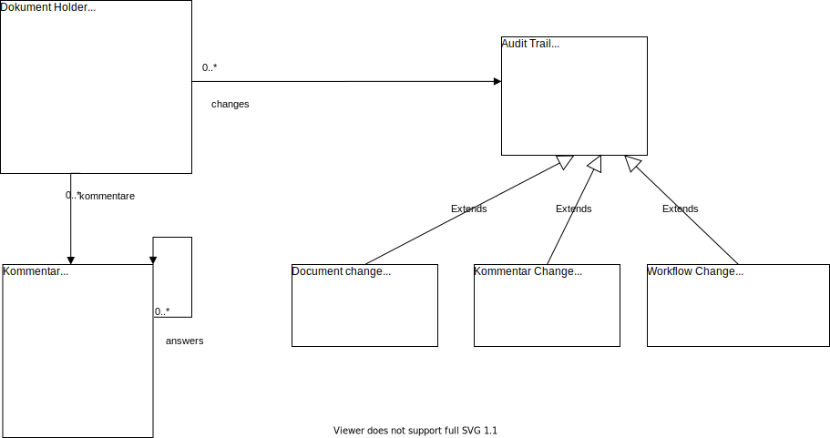

# Datenmodel

## data

The persistence layer holds **CSAF-documents** 
in the ["Common Security Advisory Framework Version 2.0"]
(https://github.com/oasis-tcs/csaf/blob/master/csaf_2.0/prose/csaf-v2-editor-draft.md) format. 
For every CSAF-document some additional information is necessary.

This additional information are:

- The **workflow state** with the possible values: `Draft, Review, Approved and Published`
- comments and answers
- the audit trail

### workflow state

The workflow state is not part of the **CSAF-document**.

The **CSAF-document** holds a state in: `/documents/tracking/status`.
But this one has the enum values: `draft, final, interim`

### Comments and answers

The user should add comments to the CSAF-document.

The comments could be for the whole document, a line or an area.

It should be possible to **answer** to a comment.

Every comment should hold the **user**, the **timestamp** 
and the **comment text**

### Audi trail

For every **CSAF-document** an audit trail should be recorded.

For every change the **user**, the **timestamp** and the **changes** should be saved.

The change should record the:
- creation and edit of documents
- changes of the workflow-status
- creation and edit of comments and answers

## Logisches Datenmodel

## Assumptions

for the model we assume the following assumptions:

- no additional data is hold in the **CSAF-document**
- the **CSAF-document**, the **comments** and the **audit trail** are hold
in different database documents to hold the size limits of the database

### Locial Model

#### Document Holder

Holds the **CSAF-document** and the following additional data:

| Field         | Usage                                            |
|---------------|--------------------------------------------------|
| id            | unique database id of the document               |
| createdBy     | user who created the initial dokument            |
| workflowState | current workflow state of the document           |
| casfDocument | the current version of the managed casf document |

#### Comments

A comment or an answer to a **CSAF-document**. A CSAF-document could
have zero to many comments.

| Field       | Usage                                                |
|-------------|------------------------------------------------------|
| id          | unique database id of the csaf document              |
| documentId  | the id of the document holder the comment belongs to |
| version     | the version of the csaf document                     |
| createdBy   | user who created the comment                         |
| createdAt   | the timestamp of the creation                        |
| jsonPath    | the path to the element in the casf document         |
| commentText | the free text of the comment                         |
| answers     | the the answers that belong to the comment           |

#### Audit Trail

All **audit trail entries** have the following field:

| Field      | Usage                                              |
|------------|----------------------------------------------------|
| id         | unique database id of the csaf document            |
| documentId | the id of the document holder the entry belongs to |
| version    | the version of the csaf document                   |
| user       | user who is responsible for the entry              |
| createdAt  | the timestamp of the creation                      |

A **document change**  has the following additional fields

| Field | Usage                                                |
|-------|------------------------------------------------------|
| diff  | the changes to the next version in Json patch format |

A **comment change**  has the following additional fields

| Field | Usage                          |
|-------|--------------------------------|
| diff  | The changes in the commentText |

A **workflow change**  has the following additional fields

| Field    | Usage                  |
|----------|------------------------|
| oldState | The old workflow state |
| newState | The new workflow state |

